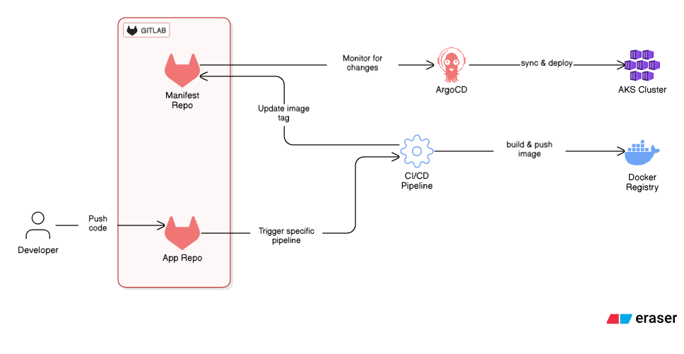
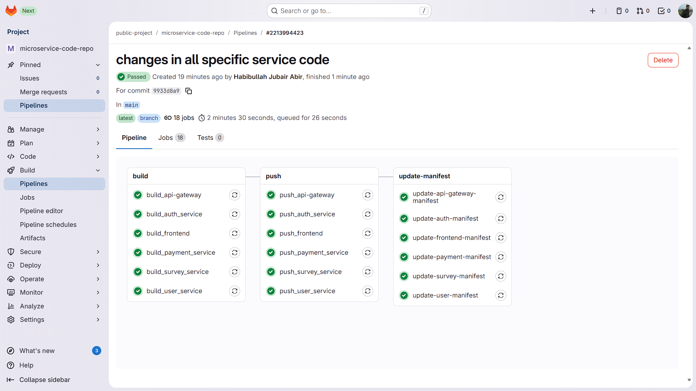
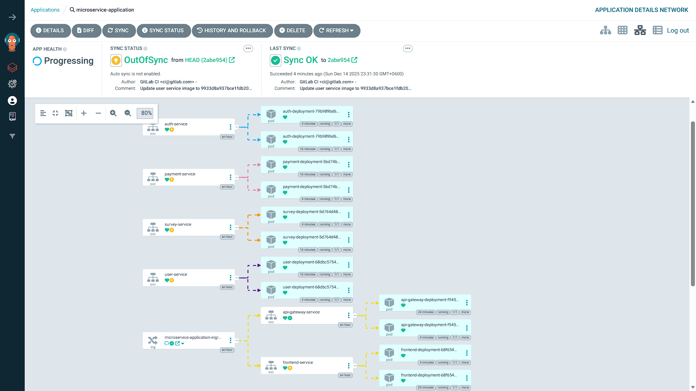

# Microservices-Based Application CI/CD with GitOps Approach

A production-ready microservices application demonstrating modern DevOps practices with automated CI/CD pipelines, containerization, and GitOps-based deployment strategies. This project showcases a complete end-to-end workflow from code commit to production deployment.

## 📋 Table of Contents

- [Overview](#overview)
- [CI/CD Pipeline](#cicd-pipeline)
- [GitOps Workflow](#gitops-workflow)
- [Technologies](#technologies)
- [Getting Started](#getting-started)
- [Diagrams](#diagrams)

## 🎯 Overview

This project implements a microservices-based application with a fully automated DevOps pipeline. The architecture follows best practices for:

- **Microservices Architecture**: Independent, scalable services
- **Containerization**: Docker-based containerization for all services
- **CI/CD Automation**: GitLab CI/CD with intelligent folder-based triggers
- **GitOps Deployment**: Automated Kubernetes manifest updates via ArgoCD

### Key Features

- ✅ **Selective Pipeline Execution**: Only builds services with code changes
- ✅ **Automated Docker Image Building**: Multi-stage builds with optimization
- ✅ **Container Registry Integration**: Automated image pushing to Docker Hub
- ✅ **GitOps Automation**: Automatic Kubernetes manifest updates
- ✅ **ArgoCD Integration**: Continuous deployment with GitOps principles
- ✅ **Production-Ready**: Error handling, retries, and best practices

## 🚀 CI/CD Pipeline

The project uses GitLab CI/CD with an optimized, folder-based trigger system.

### Pipeline Configuration

```
.gitlab-ci.yml (Main configuration)
└── gitlab-ci/
    └── templates/
        ├── api-gateway.yml
        ├── auth-service.yml
        ├── user-service.yml
        ├── survey-service.yml
        ├── payment-service.yml
        └── frontend.yml
```

### Intelligent Trigger System

The pipeline uses **folder-based change detection** to optimize build times:

```yaml
rules:
  - changes:
      - service-folder/**/*
    when: always
  - when: never
```

## 🔄 GitOps Workflow

This project implements a **GitOps** deployment strategy using a **declarative approach**:

### Workflow Steps

1. **Developer commits code** → Triggers GitLab CI/CD pipeline
2. **Build & Push** → Docker images built and pushed to registry
3. **Manifest Update** → CI/CD automatically updates Kubernetes manifests
4. **ArgoCD Sync** → ArgoCD detects changes and deploys to cluster
5. **Deployment** → New version automatically deployed

### GitOps Repository Structure

```
microservice-manifest-repo/
└── k8s-manifests/
    ├── apiGateway-deploy-svc.yml
    ├── auth-deploy-svc.yml
    ├── user-deploy-svc.yml
    ├── survey-deploy-svc.yml
    ├── payment-deploy-svc.yml
    └── frontend-deploy-svc.yml
```

### ArgoCD Integration

ArgoCD continuously monitors the manifest repository and automatically syncs changes to the Kubernetes cluster, ensuring:

- **Declarative Configuration**: Infrastructure defined as code
- **Version Control**: All changes tracked in Git
- **Automated Sync**: No manual kubectl commands needed
- **Rollback Capability**: Easy rollback via Git history

## 🛠️ Technologies

### Application Stack
- **Python 3.12**: Backend services
- **Flask**: Web framework for microservices
- **Nginx**: Frontend web server
- **MySQL**: Relational database

### DevOps Stack
- **Docker**: Containerization
- **Docker Hub**: Container registry
- **GitLab CI/CD**: Continuous Integration/Deployment
- **Kubernetes**: Container orchestration
- **ArgoCD**: GitOps continuous deployment
- **YAML**: Configuration management

### Tools & Utilities
- **yq**: YAML processing for manifest updates
- **Git**: Version control and GitOps

## 🚦 Getting Started

### CI/CD Setup

1. **Configure GitLab Variables**
   - `DOCKER_USERNAME`: Docker Hub username
   - `DOCKER_PASSWORD`: Docker Hub password/token
   - `GITLAB_TOKEN`: GitLab access token for manifest repo

2. **Pipeline triggers automatically** on:
   - Push to main/master branch
   - Merge requests
   - Manual pipeline triggers

3. **Monitor pipeline** in GitLab CI/CD → Pipelines

## 📊 Diagrams

### Pipeline Workflow


This diagram shows the full pipeline workflow and how it works.

### CI/CD Pipeline View


This diagram shows the complete GitLab CI/CD pipeline structure with all stages and jobs.

### ArgoCD Project View


This diagram illustrates the ArgoCD GitOps deployment setup and application synchronization.

## 🎯 Key DevOps Practices Demonstrated

1. **GitOps**: Declarative approach for infrastructure management and deployment
2. **Containerization**: Docker-based deployment
3. **CI/CD Automation**: Zero-touch deployment pipeline
4. **Selective Builds**: Optimized pipeline execution
5. **Version Tagging**: Immutable image tags using commit SHA
6. **Separation of Concerns**: Code repo vs. Manifest repo
7. **Automated Testing**: Pipeline validation at each stage

## 🔒 Security Considerations

- Docker images use minimal base images (Alpine Linux)
- Secrets managed via GitLab CI/CD variables
- No hardcoded credentials in code
- GitOps ensures audit trail of all changes
- Image tags use commit SHA for traceability

## 🤝 Contributing

1. Fork the repository
2. Create a feature branch (`git checkout -b feature/amazing-feature`)
3. Commit your changes (`git commit -m 'Add amazing feature'`)
4. Push to the branch (`git push origin feature/amazing-feature`)
5. Open a Merge Request

## 📄 License

This project is for demonstration purposes.

## 👤 Author

**Habibullah Jubair**

---

## 📚 Additional Resources

- [GitLab CI/CD Documentation](https://docs.gitlab.com/ee/ci/)
- [ArgoCD Documentation](https://argo-cd.readthedocs.io/)
- [Kubernetes Documentation](https://kubernetes.io/docs/)
- [Docker Best Practices](https://docs.docker.com/develop/dev-best-practices/)
- [GitOps Principles](https://www.gitops.tech/)

---

**⭐ If you find this project helpful, please give it a star!**

code repo : https://gitlab.com/public-project8832250/microservice-code-repo.git
manifest repo : https://gitlab.com/public-project8832250/microservice-manifest-repo.git
